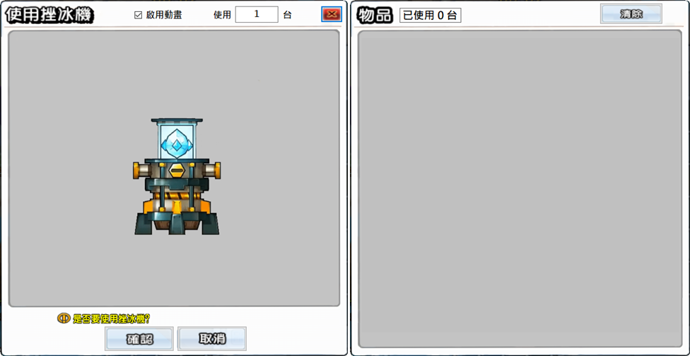
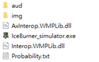
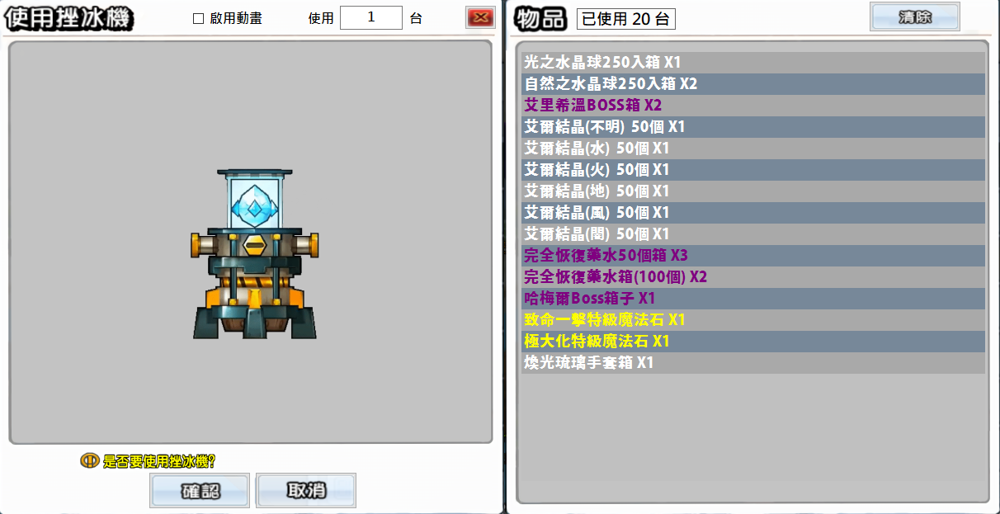
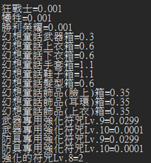

## 這是一項 2020 年的專案，目前已不再更新，若有需要請自行下載使用
### 冰機模擬TREE 介紹

**這個程式顧名思義就是個冰機模擬器，平時無聊或手癢想抽冰機時，可以用來讓你~認清現實~試試手氣。**

**下載：**[TREEEEE](https://github.com/wonk2563/IceBurn_simulator/releases/download/Release/Ice_Burner_Simulator.zip)

※冰機模擬器內容物與機率以 \[[幻想童話](https://iteminfo.nexon.com/probability/elsword?sn=2627)\] 冰機為準。

※2021.05.28 更新冰機資料至 \[幻想童話\]。

※2021.02.25 更新冰機資料至 \[埃力格\]。

※2020.12.24 更新冰機資料至 \[魅影君主\]、新增檢查更新功能。

※2020.09.25 更新改善使用台數太高時運行效能太低的問題。

### 使用說明

**1**. 下載下來後解壓縮，會有多個檔案

**2**. 開啟IceBurner\_simulator.exe

**3**. 在視窗上方可以設定是否啟用動畫以及一次要使用的台數

※在台數設定欄位，直接按下 \[**Enter**\] 會直接開始抽

**4**. 設定好後就可以按下 \[**確認**\] 開始抽冰機，抽完會在左方物品欄處顯示獲得物品

※若勾選啟用動畫，在冰機轉動期間可以按下 \[取消\] 來停止動畫

**5**. 抽完可以點擊物品欄右方的 \[**清除**\] 清除底下物品欄並重置已使用台數

### Probability.txt

可以透過更改 **Probability.txt** 來更改冰機的內容物及相關機率
 
